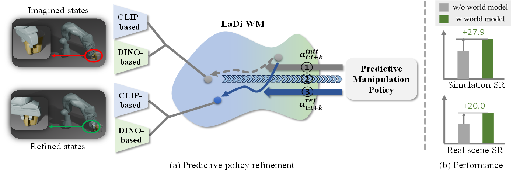

# LaDiWM--CoRL2025
### LaDiWM: A Latent Diffusion-based World Model for Predictive Manipulation ([](https://guhuangai.github.io/LaDiWM.github.io/)	[](https://arxiv.org/abs/2505.11528))


### Installation
```bash
git clone https://github.com/GuHuangAI/LaDiWM.git
cd LaDiWM
conda env create -f environment.yml
conda activate ladiwm
```

### Data Preparation
1. Download [LIBERO](https://libero-project.github.io/datasets) dataset, note that we train the world model with LIBERO-90, and policy model with LIBERO-LONG (LIBERO-10).
2. Process the dataset following [ATM](https://github.com/Large-Trajectory-Model/ATM#dataset-preprocessing).
3. Download DINO pretrained weight from [here](https://dl.fbaipublicfiles.com/dinov2/dinov2_vitb14/dinov2_vitb14_pretrain.pth), and search for 'dinov2_vitb14_pretrain.pth' in the [wm config file](./conf/train_track_transformer/libero_diff_transformer_action.yaml) and [policy config file](./conf/train_bc/libero_vilt_dino_siglip_wm.yaml), and replace the original path by your local path.

### Training
1. To train the world model, you need to modify line-20 of the [training script](./scripts/train_libero_diffusion_transformer_action_base.py) to your local data path. In addition, you should modify line-8 and line-10 of the [wm config file](./conf/train_track_transformer/libero_diff_transformer_action.yaml) to change the save path.
```bash
PYTHONPATH=$(pwd) python ./scripts/train_libero_diffusion_transformer_action_base.py 
```
2. To train the policy model, you need to modify line-30 of the [training script](./scripts/train_libero_policy_diff_action.py) to your local data path.
```bash
PYTHONPATH=$(pwd) python ./scripts/train_libero_policy_diff_action.py -tt $Your local path for saving world model
```
### Evaluation
modify line-21 of the [testing script](./scripts/eval_libero_policy_action.py) to your local data path.
```bash
PYTHONPATH=$(pwd) python ./scripts/eval_libero_policy_action.py --exp-dir $Your local path for saving policy model
```

### Thanks and Contact
Thanks to the public repos: [ADM](https://github.com/GuHuangAI/ADM-Public) and [ATM](https://github.com/Large-Trajectory-Model/ATM) for providing the base codes. 
If you have some questions, please contact with [GuHuangAI](huangai@nudt.edu.cn).

## Citation
~~~
@inproceedings{huang2025ladi,
  title={LaDi-WM: A Latent Diffusion-based World Model for Predictive Manipulation},
  author={Huang, Yuhang and Zhang, Jiazhao and Zou, Shilong and Liu, Xinwang and Hu, Ruizhen and Xu, Kai},
  booktitle={CoRL},
  year={2025}
}
~~~